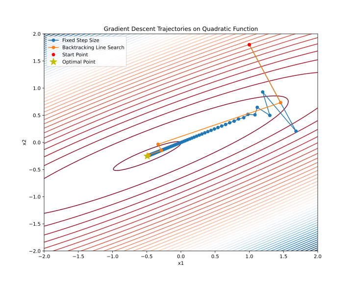
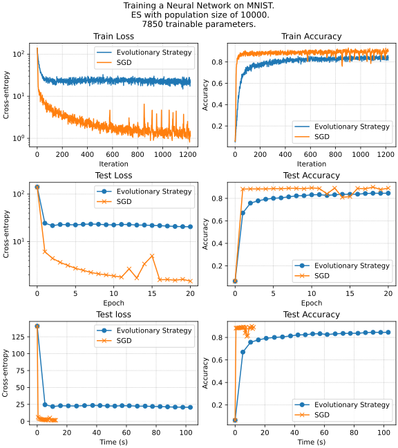

### Matrix calculus

1. Given a matrix $A$ of size $m \times n$ and a vector $x$ of size $n \times 1$, compute the gradient of the function $f(x) = \text{tr}(A^T A x x^T)$ with respect to $x$.

1. Find the gradient $\nabla f(x)$ and hessian $f''(x)$, if $f(x) = \dfrac{1}{2} \Vert Ax - b\Vert^2_2$.
1. Find the gradient $\nabla f(x)$ and hessian $f''(x)$, if 
    $$
    f(x) = \frac1m \sum\limits_{i=1}^m \log \left( 1 + \exp(a_i^{T}x) \right) + \frac{\mu}{2}\Vert x\Vert _2^2, \; a_i, x \in \mathbb R^n, \; \mu>0
    $$
1. Compute the gradient $\nabla_A f(A)$ of the trace of the matrix exponential function $f(A) = \text{tr}(e^A)$ with respect to $A$. Hint: hint: Use the definition of the matrix exponential. Use the definition of the differential $df = f(A + dA) - f(A) + o(\Vert dA \Vert)$ with the limit $\Vert dA \Vert \to 0$.
1. Find the gradient $\nabla f(x)$ and hessian $f''(x)$, if $f(x) = \frac{1}{2}\Vert A - xx^T\Vert^2_F, A \in \mathbb{S}^n$
1. Calculate the first and the second derivative of the following function $f : S \to \mathbb{R}$

    $$
    f(t) = \text{det}(A − tI_n),
    $$


    where $A \in \mathbb{R}^{n \times n}, S := \{t \in \mathbb{R} : \text{det}(A − tI_n) \neq 0\}$.
1. Find the gradient $\nabla f(X)$, if $f(X) = \text{tr}\left( AX^2BX^{-\top} \right)$.

### Automatic differentiation and jax
You can use any automatic differentiation framework in this section (Jax, PyTorch, Autograd etc.)

1. You will work with the following function for this exercise,
    $$
    f(x,y)=e^{−\left(sin(x)−cos(y)\right)^2}
    $$  
    Draw the computational graph for the function. Note, that it should contain only primitive operations - you need to do it automatically -  [jax example](https://bnikolic.co.uk/blog/python/jax/2022/02/22/jax-outputgraph-rev.html), [PyTorch example](https://github.com/waleedka/hiddenlayer) - you can google/find your way to visualize it.

1. Compare analytic and autograd (with any framework) approach for the calculation of the gradient of:      
    $$
    f(A) = \text{tr}(e^A)
    $$
1. We can use automatic differentiation not only to calculate necessary gradients but also for tuning hyperparameters of the algorithm like learning rate in gradient descent (with gradient descent 🤯). Suppose, we have the following function $f(x) = \frac{1}{2}\Vert x\Vert^2$, select a random point $x_0 \in \mathbb{B}^{1000} = \{0 \leq x_i \leq 1 \mid \forall i\}$. Consider $10$ steps of the gradient descent starting from the point $x_0$:
    $$
    x_{k+1} = x_k - \alpha_k \nabla f(x_k)
    $$
    Your goal in this problem is to write the function, that takes $10$ scalar values $\alpha_i$ and return the result of the gradient descent on function $L = f(x_{10})$. And optimize this function using gradient descent on $\alpha \in \mathbb{R}^{10}$. Suppose that each of $10$ components of $\alpha$ is uniformly distributed on $[0; 0.1]$.
    $$
    \alpha_{k+1} = \alpha_k - \beta \frac{\partial L}{\partial \alpha}
    $$
    Choose any constant $\beta$ and the number of steps you need. Describe the obtained results. How would you understand, that the obtained schedule ($\alpha \in \mathbb{R}^{10}$) becomes better than it was at the start? How do you check numerically local optimality in this problem? 
1. Compare analytic and autograd (with any framework) approach for the gradient of:     
    $$
    f(X) = - \log \det X
    $$
1. Compare analytic and autograd (with any framework) approach for the gradient and hessian of:     
    $$
    f(x) = x^\top x x^\top x
    $$
---

### Convex sets

1. Show, that if $S \subseteq \mathbb{R}^n$ is convex set, then its interior $\mathbf{int } S$ and closure $\bar{S}$  are also convex sets.
1. Show, that $\mathbf{conv}\{xx^\top: x \in \mathbb{R}^n, \Vert x\Vert  = 1\} = \{A \in \mathbb{S}^n_+: \text{tr}(A) = 1\}$.
1. Let $K \subseteq \mathbb{R}^n_+$ is a cone. Prove that it is convex if and only if a set of $\{x \in K \mid \sum\limits_{i=1}^n x_i = 1 \}$ is convex.
1. Prove that the set of $\{x \in \mathbb{R}^2 \mid e^{x_1}\le x_2\}$ is convex.
1. Show that the set of directions of the non-strict local descending of the differentiable function in a point is a convex cone. (Previously, the question contained a typo "strict local descending")
1. Is the following set convex
    $$
    S = \left\{ a \in \mathbb{R}^k \mid p(0) = 1, \vert p(t) \vert\leq 1 \text{ for } \alpha\leq t \leq \beta\right\},
    $$
    where
    $$
    p(t) = a_1 + a_2 t + \ldots + a_k t^{k-1} \;?
    $$

---

### Convex functions

1. Consider the function $f(x) = x^d$, where $x \in \mathbb{R}_{+}$. Fill the following table with ✅ or ❎. Explain your answers

    | $d$ | Convex | Concave | Strictly Convex | $\mu$-strongly convex |
    |:-:|:-:|:-:|:-:|:-:|
    | $-2, x \in \mathbb{R}_{++}$| | | | |
    | $-1, x \in \mathbb{R}_{++}$| | | | |
    | $0$| | | | |
    | $0.5$ | | | | |
    |$1$ | | | | |
    | $\in (1; 2)$ | | | | |
    | $2$| | | | |
    | $> 2$| | | | 

    : {.responsive}

1. Prove that the entropy function, defined as

    $$
    f(x) = -\sum_{i=1}^n x_i \log(x_i),
    $$

    with $\text{dom}(f) = \{x \in \R^n_{++} : \sum_{i=1}^n x_i = 1\}$, is strictly concave.  

1. Show, that the function $f: \mathbb{R}^n_{++} \to \mathbb{R}$ is convex if $f(x) = - \prod\limits_{i=1}^n x_i^{\alpha_i}$ if $\mathbf{1}^T \alpha = 1, \alpha \succeq 0$.

1. Show that the maximum of a convex function $f$ over the polyhedron $P = \text{conv}\{v_1, \ldots, v_k\}$ is achieved at one of its vertices, i.e.,

    $$
    \sup_{x \in P} f(x) = \max_{i=1, \ldots, k} f(v_i).
    $$

    A stronger statement is: the maximum of a convex function over a closed bounded convex set is achieved at an extreme point, i.e., a point in the set that is not a convex combination of any other points in the set. (you do not have to prove it). *Hint:* Assume the statement is false, and use Jensen’s inequality.

1. Show, that the two definitions of $\mu$-strongly convex functions are equivalent:
    1. $f(x)$ is $\mu$-strongly convex $\iff$ for any $x_1, x_2 \in S$ and $0 \le \lambda \le 1$ for some $\mu > 0$:
        
        $$
        f(\lambda x_1 + (1 - \lambda)x_2) \le \lambda f(x_1) + (1 - \lambda)f(x_2) - \frac{\mu}{2} \lambda (1 - \lambda)\|x_1 - x_2\|^2
        $$

    1. $f(x)$ is $\mu$-strongly convex $\iff$ if there exists $\mu>0$ such that the function $f(x) - \dfrac{\mu}{2}\Vert x\Vert^2$ is convex.

### Conjugate sets

1. Let $\mathbb{A}_n$ be the set of all $n$ dimensional antisymmetric matrices (s.t. $X^T = - X$). Show that $\left( \mathbb{A}_n\right)^* = \mathbb{S}_n$. 
1. Find the sets $S^{*}, S^{**}, S^{***}$, if 
    
    $$
    S = \{ x \in \mathbb{R}^2 \mid x_1 + x_2 \ge 0, \;\; -\dfrac12x_1 + x_2 \ge 0, \;\; 2x_1 + x_2 \ge -1 \;\; -2x_1 + x_2 \ge -3\}
    $$

1. Prove, that $B_p$ and $B_{p_*}$ are inter-conjugate, i.e. $(B_p)^* = B_{p_*}, (B_{p_*})^* = B_p$, where $B_p$ is the unit ball (w.r.t. $p$ - norm) and $p, p_*$ are conjugated, i.e. $p^{-1} + p^{-1}_* = 1$. You can assume, that $p_* = \infty$ if $p = 1$ and vice versa.

---

### Conjugate functions

1. Find $f^*(y)$, if $f(x) = \vert 2x \vert$
1. Prove, that if $f(x) = \inf\limits_{u+v = x} (g(u) + h(v))$, then $f^*(y) = g^*(y) + h^*(y)$.
1. Find $f^*(y)$, if $f(x) = \log \left( \sum\limits_{i=1}^n e^{x_i} \right)$
1. Prove, that if $f(x) = g(Ax)$, then $f^*(y) = g^*(A^{-\top}y)$
1. Find $f^*(Y)$, if $f(X) = - \ln \det X, X \in \mathbb{S}^n_{++}$
1. The scalar Huber function is defined as

    $$
    f_{\text{hub}}(x) = 
    \begin{cases} 
    \frac{1}{2} x^2 & \text{if } |x| \leq 1 \\
    |x| - \frac{1}{2} & \text{if } |x| > 1
    \end{cases}
    $$

    

    This convex function arises in various applications, notably in robust estimation. This problem explores the generalizations of the Huber function to $\mathbb{R}^n$. A straightforward extension to $\mathbb{R}^n$ is expressed as $f_{\text{hub}}(x_1) + \ldots + f_{\text{hub}}(x_n)$, yet this formulation is not circularly symmetric, that is, it's not invariant under the transformation of $x$ by an orthogonal matrix. A circularly symmetric extension to $\mathbb{R}^n$ is given by

    $$
    f_{\text{cshub}}(x) = f_{\text{hub}}(\Vert x\Vert )= 
    \begin{cases} 
    \frac{1}{2} \Vert x\Vert_2 ^2 & \text{if } \Vert x\Vert_2 \leq 1 \\
    \Vert x\Vert_2 - \frac{1}{2} & \text{if } \Vert x\Vert_2 > 1
    \end{cases}
    $$

    where the subscript denotes "circularly symmetric Huber function". Show, that $f_{\text{cshub}}$ is convex. Find the conjugate function $f^*(y)$.

---

### Subgradient and subdifferential

1. Find $\partial f(x)$, if 
    $$
    f(x) = \text{Parametric ReLU}(x) = \begin{cases}
        x & \text{if } x > 0, \\
        ax & \text{otherwise}.
    \end{cases}
    $$
1. Prove, that $x_0$ - is the minimum point of a function $f(x)$ if and only if $0 \in \partial f(x_0)$.
1. Find $\partial f(x)$, if $f(x) = \Vert Ax - b\Vert _1$.
1. Find $\partial f(x)$, if $f(x) = e^{\Vert x\Vert}$.
1. Find $\partial f(x)$, if $f(x) = \frac12 \Vert Ax - b\Vert _2^2 + \lambda \Vert x\Vert_1, \quad \lambda > 0$.
1. Let $S \subseteq \mathbb{R}^n$ be a convex set. We will call a *normal cone* of the set $S$ at a point $x$ the following set:
    $$
    N_S(x) = \left\{c \in \mathbb{R}^n : \langle c, y-x\rangle \leq 0 \quad \forall y \in S\right\}
    $$
    i) Draw a normal cone for a set at the points $A, B, C, D, E, F$ on the figure below: 
    
        
    
    i) Show, that $N_S(x) = \{0\} \quad \forall x \in \mathbf{ri }(S)$.
    i) Show, that the subdifferential $\partial I_S(x) = N_S(x)$ if $I_S(x)$ is the indicator function, i.e. 
        $$
        I_S(x) = \begin{cases}0,\text{if } x \in S\\ \infty, \text{otherwise}\end{cases}
        $$

---

### KKT and duality

In this section, you can consider either the arbitrary norm or the Euclidian norm if nothing else is specified.

1. **Toy example**
    $$
    \begin{split}
    & x^2 + 1 \to \min\limits_{x \in \mathbb{R} }\\
    \text{s.t. } & (x-2)(x-4) \leq 0
    \end{split}
    $$

    1. Give the feasible set, the optimal value, and the optimal solution.
    1.  Plot the objective $x^2 +1$ versus $x$. On the same plot, show the feasible set, optimal point, and value, and plot the Lagrangian $L(x,\mu)$ versus $x$ for a few positive values of $\mu$. Verify the lower bound property ($p^* \geq \inf_x L(x, \mu)$for $\mu \geq 0$). Derive and sketch the Lagrange dual function $g$.
    1. State the dual problem, and verify that it is a concave maximization problem. Find the dual optimal value and dual optimal solution $\mu^*$. Does strong duality hold?
    1.  Let $p^*(u)$ denote the optimal value of the problem

    $$
    \begin{split}
    & x^2 + 1 \to \min\limits_{x \in \mathbb{R} }\\
    \text{s.t. } & (x-2)(x-4) \leq u
    \end{split}
    $$

    as a function of the parameter $u$. Plot $p^*(u)$. Verify that $\dfrac{dp^*(0)}{du} = -\mu^*$ 

1. Derive the dual problem for the Ridge regression problem with $A \in \mathbb{R}^{m \times n}, b \in \mathbb{R}^m, \lambda > 0$:

    $$
    \begin{split}
    \dfrac{1}{2}\|y-b\|^2 + \dfrac{\lambda}{2}\|x\|^2 &\to \min\limits_{x \in \mathbb{R}^n, y \in \mathbb{R}^m }\\
    \text{s.t. } & y = Ax
    \end{split}
    $$

1. Derive the dual problem for the support vector machine problem with $A \in \mathbb{R}^{m \times n}, \mathbf{1} \in \mathbb{R}^m \in \mathbb{R}^m, \lambda > 0$:

    $$
    \begin{split}
    \langle \mathbf{1}, t\rangle + \dfrac{\lambda}{2}\|x\|^2 &\to \min\limits_{x \in \mathbb{R}^n, t \in \mathbb{R}^m }\\
    \text{s.t. } & Ax \succeq \mathbf{1} - t \\
    & t \succeq 0
    \end{split}
    $$

1. Give an explicit solution to the following LP.
    
    $$
    \begin{split}
    & c^\top x \to \min\limits_{x \in \mathbb{R}^n }\\
    \text{s.t. } & 1^\top x = 1, \\
    & x \succeq 0 
    \end{split}
    $$

    This problem can be considered the simplest portfolio optimization problem.

1. Show, that the following problem has a unique solution and find it:

    $$
    \begin{split}
    & \langle C^{-1}, X\rangle - \log \det X \to \min\limits_{x \in \mathbb{R}^{n \times n} }\\
    \text{s.t. } & \langle Xa, a\rangle \leq 1,
    \end{split}
    $$

    where $C \in \mathbb{S}^n_{++}, a \in \mathbb{R}^n \neq 0$. The answer should not involve inversion of the matrix $C$.

1. Give an explicit solution to the following QP.
    
    $$
    \begin{split}
    & c^\top x \to \min\limits_{x \in \mathbb{R}^n }\\
    \text{s.t. } & (x - x_c)^\top A (x - x_c) \leq 1,
    \end{split}
    $$

    where $A \in \mathbb{S}^n_{++}, c \neq 0, x_c \in \mathbb{R}^n$.

1.  Consider the equality-constrained least-squares problem
    
    $$
    \begin{split}
    & \|Ax - b\|_2^2 \to \min\limits_{x \in \mathbb{R}^n }\\
    \text{s.t. } & Cx = d,
    \end{split}
    $$

    where $A \in \mathbb{R}^{m \times n}$ with $\mathbf{rank }A = n$, and $C \in \mathbb{R}^{k \times n}$ with $\mathbf{rank }C = k$. Give the KKT conditions, and derive expressions for the primal solution $x^*$ and the dual solution $\lambda^*$.

1. Derive the KKT conditions for the problem
    
    $$
    \begin{split}
    & \mathbf{tr \;}X - \log\text{det }X \to \min\limits_{X \in \mathbb{S}^n_{++} }\\
    \text{s.t. } & Xs = y,
    \end{split}
    $$

    where $y \in \mathbb{R}^n$ and $s \in \mathbb{R}^n$ are given with $y^\top s = 1$. Verify that the optimal solution is given by

    $$
    X^* = I + yy^\top - \dfrac{1}{s^\top s}ss^\top
    $$

1.  **Supporting hyperplane interpretation of KKT conditions**. Consider a **convex** problem with no equality constraints
    
    $$
    \begin{split}
    & f_0(x) \to \min\limits_{x \in \mathbb{R}^n }\\
    \text{s.t. } & f_i(x) \leq 0, \quad i = [1,m]
    \end{split}
    $$

    Assume, that $\exists x^* \in \mathbb{R}^n, \mu^* \in \mathbb{R}^m$ satisfy the KKT conditions
    
    $$
    \begin{split}
    & \nabla_x L (x^*, \mu^*) = \nabla f_0(x^*) + \sum\limits_{i=1}^m\mu_i^*\nabla f_i(x^*) = 0 \\
    & \mu^*_i \geq 0, \quad i = [1,m] \\
    & \mu^*_i f_i(x^*) = 0, \quad i = [1,m]\\
    & f_i(x^*) \leq 0, \quad i = [1,m]
    \end{split}
    $$

    Show that

    $$
    \nabla f_0(x^*)^\top (x - x^*) \geq 0
    $$

    for all feasible $x$. In other words, the KKT conditions imply the simple optimality criterion or $\nabla f_0(x^*)$ defines a supporting hyperplane to the feasible set at $x^*$.

1.  **Fenchel + Lagrange = ♥.** Express the dual problem of
    
    $$
    \begin{split}
    & c^\top x\to \min\limits_{x \in \mathbb{R}^n }\\
    \text{s.t. } & f(x) \leq 0
    \end{split}
    $$

    with $c \neq 0$, in terms of the conjugate function $f^*$. Explain why the problem you give is convex. We do not assume $f$ is convex.
    
1. **A penalty method for equality constraints.** We consider the problem of minimization

    $$
    \begin{split}
    & f_0(x) \to \min\limits_{x \in \mathbb{R}^{n} }\\
    \text{s.t. } & Ax = b,
    \end{split}
    $$
    
    where $f_0(x): \mathbb{R}^n \to\mathbb{R} $ is convex and differentiable, and $A \in \mathbb{R}^{m \times n}$ with $\mathbf{rank }A = m$. In a quadratic penalty method, we form an auxiliary function

    $$
    \phi(x) = f_0(x) + \alpha \|Ax - b\|_2^2,
    $$
    
    where $\alpha > 0$ is a parameter. This auxiliary function consists of the objective plus the penalty term $\alpha \Vert Ax - b\Vert_2^2$. The idea is that a minimizer of the auxiliary function, $\tilde{x}$, should be an approximate solution to the original problem. Intuition suggests that the larger the penalty weight $\alpha$, the better the approximation $\tilde{x}$ to a solution of the original problem. Suppose $\tilde{x}$ is a minimizer of $\phi(x)$. Show how to find, from $\tilde{x}$, a dual feasible point for the original problem. Find the corresponding lower bound on the optimal value of the original problem.
    
1. **Analytic centering.** Derive a dual problem for
    
    $$
    -\sum_{i=1}^m \log (b_i - a_i^\top x) \to \min\limits_{x \in \mathbb{R}^{n} }
    $$

    with domain $\{x \mid a^\top_i x < b_i , i = [1,m]\}$. 
    
    First introduce new variables $y_i$ and equality constraints $y_i = b_i − a^\top_i x$. (The solution to this problem is called the analytic center of the linear inequalities $a^\top_i x \leq b_i ,i = [1,m]$.  Analytic centers have geometric applications, and play an important role in barrier methods.) 

---
    
### Linear programming

1. **📱🎧💻 Covers manufacturing.** Lyzard Corp is producing covers for the following products: 
    * 📱 phones
    * 🎧 headphones
    * 💻 laptops

    The company’s production facilities are such that if we devote the entire production to headphone covers, we can produce 5000 of them in one day. If we devote the entire production to phone covers or laptop covers, we can produce 4000 or 2000 of them in one day. 

    The production schedule is one week (6 working days), and the week’s production must be stored before distribution. Storing 1000 headphone covers (packaging included) takes up 30 cubic feet of space. Storing 1000 phone covers (packaging included) takes up 50 cubic feet of space, and storing 1000 laptop covers (packaging included) takes up 220 cubic feet of space. The total storage space available is 1500 cubic feet. 
    
    Due to commercial agreements with Lyzard Corp has to deliver at least 4500 headphone covers and 4000 laptop covers per week to strengthen the product’s diffusion. 

    The marketing department estimates that the weekly demand for headphones covers, phone, and laptop covers does not exceed 10000 14000, and 7000 units, therefore the company does not want to produce more than these amounts for headphones, phone, and laptop covers. 

    Finally, the net profit per headphone cover, phone cover, and laptop cover are \$5, \$7, and \$12, respectively.

    The aim is to determine a weekly production schedule that maximizes the total net profit.

    1. Write a Linear Programming formulation for the problem.  Use the following variables:

        * $y_1$ = number of headphones covers produced over the week,  
        * $y_2$ = number of phone covers produced over the week,  
        * $y_3$ = number of laptop covers produced over the week. 

    1. Find the solution to the problem using [PyOMO](http://www.pyomo.org)
    
        ```python
        !pip install pyomo
        ! sudo apt-get install glpk-utils --quiet  # GLPK
        ! sudo apt-get install coinor-cbc --quiet  # CoinOR
        ```

    1. Perform the sensitivity analysis. Which constraint could be relaxed to increase the profit the most? Prove it numerically.

1. Prove the optimality of the solution
    
    $$
    x = \left(\frac{7}{3} , 0, \frac{1}{3}\right)^T
    $$
    
    to the following linear programming problem:
    
    $$
    \begin{split}
    & 9x_1 + 3x_2 + 7x_3 \to \max\limits_{x \in \mathbb{R}^3 }\\
    \text{s.t. } & 2x_1 + x_2 + 3x_3 \leq 6 \\
    & 5x_1 + 4x_2 + x_3 \leq 12 \\
    & 3x_3 \leq 1,\\
    & x_1, x_2, x_3 \geq 0
    \end{split}
    $$

    but you cannot use any numerical algorithm here.

1. Transform the following linear program into an equivalent linear program in the standard form $\left(c^\top x \to \min\limits_{x\in \mathbb{R}^n} : Ax = b,x ≥ 0\right)$:

    $$
    \begin{split}
    & x_1−x_2 \to \min\limits_{x \in \mathbb{R}^2 }\\
    \text{s.t. } & 2x_1 + x_2 \geq 3 \\
    & 3x_1 − x_2 \leq 7 \\
    & x_1 \geq 0
    \end{split}
    $$

1. Consider:

    $$
    \begin{split}
    & 4x_1 + 5x_2 + 2x_3 \to \max\limits_{x \in \mathbb{R}^3 }\\
    \text{s.t. } & 2x_1 - x_2 + 2x_3 \leq 9 \\
    & 3x_1 + 5x_2 + 4x_3 \leq 8 \\
    & x_1 + x_2 + 2x_3 \leq 2 \\
    & x_1, x_2, x_3 \geq 0,
    \end{split}
    $$

    1. Find an optimal solution to the Linear Programming problem using the simplex method.
    1. Write the dual linear program. Find an optimal dual solution. Do we have strong duality here?

---

### Sequence convergence

1. Determine the convergence or divergence of a given sequences

    * $r_{k} = \frac{1}{\sqrt{k}}$.
    * $r_{k} = 0.606^k$.
    * $r_{k} = 0.606^{2^k}$.

1. Determine the convergence or divergence of a given sequence $r_k =\begin{cases} \frac{1}{k}, & \text{if } k\text{ is even} \\ e^{-k}, & \text{if } k\text{ is odd} \end{cases}$.

1. Determine the following sequence $\{r_k\}$ by convergence rate (linear, sublinear, superlinear). In the case of superlinear convergence, additionally, find out whether there is quadratic convergence.

    $$
    r_k = \dfrac{1}{k!}
    $$

1. Determine the following sequence $\{r_k\}$ by convergence rate (linear, sublinear, superlinear). In the case of superlinear convergence, additionally find out whether there is quadratic convergence.

    $$
    r_k = \dfrac{1}{k^k}
    $$

1. Let $\{r_k\}$ be a sequence of non-negative numbers given as $r_{k+1} = Mr_k^2$, where $M > 0$, $r_0 \geq 0$. Establish a necessary and sufficient condition on $M$ and $r_0$ under which the sequence $r_k$ will converge to zero. What is the rate of convergence?

### Line search

1. Show that for a one-dimensional quadratic function decreasing at zero, its minimum satisfies
Armijo's condition for any $c_1: 0 \leq c_1 \leq \dfrac12$: 

    $$
    f(x_k - \alpha \nabla f (x_k)) \leq f(x_k) - c_1 \cdot \alpha\|\nabla f(x_k)\|_2^2
    $$

1. **Implementing and Testing Line Search Conditions in Gradient Descent**

    $$
    x_{k+1} = x_k - \alpha \nabla f(x_k)
    $$
    
    In this assignment, you will modify an existing Python code for gradient descent to include various line search conditions. You will test these modifications on two functions: a quadratic function and the Rosenbrock function. The main objectives are to understand how different line search strategies influence the convergence of the gradient descent algorithm and to compare their efficiencies based on the number of function evaluations.

    ```python
    import numpy as np
    import matplotlib.pyplot as plt
    from scipy.optimize import minimize_scalar
    np.random.seed(214)

    # Define the quadratic function and its gradient
    def quadratic_function(x, A, b):
        return 0.5 * np.dot(x.T, np.dot(A, x)) - np.dot(b.T, x)

    def grad_quadratic(x, A, b):
        return np.dot(A, x) - b

    # Generate a 2D quadratic problem with a specified condition number
    def generate_quadratic_problem(cond_number):
        # Random symmetric matrix
        M = np.random.randn(2, 2)
        M = np.dot(M, M.T)

        # Ensure the matrix has the desired condition number
        U, s, V = np.linalg.svd(M)
        s = np.linspace(cond_number, 1, len(s))  # Spread the singular values
        A = np.dot(U, np.dot(np.diag(s), V))

        # Random b
        b = np.random.randn(2)

        return A, b

    # Gradient descent function
    def gradient_descent(start_point, A, b, stepsize_func, max_iter=100):
        x = start_point.copy()
        trajectory = [x.copy()]

        for i in range(max_iter):
            grad = grad_quadratic(x, A, b)
            step_size = stepsize_func(x, grad)
            x -= step_size * grad
            trajectory.append(x.copy())

        return np.array(trajectory)

    # Backtracking line search strategy using scipy
    def backtracking_line_search(x, grad, A, b, alpha=0.3, beta=0.8):
        def objective(t):
            return quadratic_function(x - t * grad, A, b)
        res = minimize_scalar(objective, method='golden')
        return res.x

    # Generate ill-posed problem
    cond_number = 30
    A, b = generate_quadratic_problem(cond_number)

    # Starting point
    start_point = np.array([1.0, 1.8])

    # Perform gradient descent with both strategies
    trajectory_fixed = gradient_descent(start_point, A, b, lambda x, g: 5e-2)
    trajectory_backtracking = gradient_descent(start_point, A, b, lambda x, g: backtracking_line_search(x, g, A, b))

    # Plot the trajectories on a contour plot
    x1, x2 = np.meshgrid(np.linspace(-2, 2, 400), np.linspace(-2, 2, 400))
    Z = np.array([quadratic_function(np.array([x, y]), A, b) for x, y in zip(x1.flatten(), x2.flatten())]).reshape(x1.shape)

    plt.figure(figsize=(10, 8))
    plt.contour(x1, x2, Z, levels=50, cmap='viridis')
    plt.plot(trajectory_fixed[:, 0], trajectory_fixed[:, 1], 'o-', label='Fixed Step Size')
    plt.plot(trajectory_backtracking[:, 0], trajectory_backtracking[:, 1], 'o-', label='Backtracking Line Search')

    # Add markers for start and optimal points
    plt.plot(start_point[0], start_point[1], 'ro', label='Start Point')
    optimal_point = np.linalg.solve(A, b)
    plt.plot(optimal_point[0], optimal_point[1], 'y*', markersize=15, label='Optimal Point')

    plt.legend()
    plt.title('Gradient Descent Trajectories on Quadratic Function')
    plt.xlabel('x1')
    plt.ylabel('x2')
    plt.savefig("linesearch.svg")
    plt.show()
    ```

    

    Start by reviewing the provided Python code. This code implements gradient descent with a fixed step size and a backtracking line search on a quadratic function. Familiarize yourself with how the gradient descent function and the step size strategies are implemented.

    1. Modify the gradient descent function to include the following line search conditions:
        
        a. Sufficient Decrease Condition
        b. Curvature Condition
        c. Goldstein Condition
        d. Wolfe Condition
        e. Dichotomy
        
        Test your modified gradient descent algorithm with the implemented line search conditions on the provided quadratic function. Plot the trajectories over iterations for each condition. Choose and specify hyperparameters for inexact line search condition. Choose and specify the termination criterion. Start from the point $x_0 = (-1, 2)^T$.

    1. Compare these 7 methods from the budget perspective. Plot the graph of function value from the number of function evaluations for each method on the same graph.

    1. Plot trajectory for another function with the same set of methods
    
        $$
        f(x_1, x_2) =  10(x_2 − x_1^2)^2 + (x_1 − 1)^2
        $$

        with $x_0 = (-1, 2)^T$. You might need to adjust hyperparameters.

    1. Plot the same function value from the number of function calls for this experiment.

### Zero-order methods

1. Solve approximately the Travelling Salesman Problem with any zero-order optimization method.

    

    ```python
    import numpy as np
    from scipy.spatial import distance_matrix
    import random

    def generate_random_symmetric_tsp(num_cities, seed=0):
        np.random.seed(seed)
        points = np.random.rand(num_cities, 2)  # Generate random coordinates
        dist_matrix = distance_matrix(points, points)
        dist_matrix = (dist_matrix + dist_matrix.T) / 2  # Ensure symmetry
        return jnp.array(dist_matrix)  # Convert to JAX array for further processing

    # Example usage
    num_cities = 10
    dist_matrix = generate_random_symmetric_tsp(num_cities)
    print(dist_matrix)

    ```

    * You can use the [genetic](https://fmin.xyz/docs/applications/salesman_problem.html) algorithm with any significant modification of mutation\breeding  (5/10)
    * You can use another algorithm (10/10)

1. In this assignment, we aim to explore and compare the efficacy of traditional and zero-order optimization methods in training a simple neural network. The conventional approach, Stochastic Gradient Descent (SGD), has been widely used due to its efficiency in handling large datasets and its capability to work in a huge-scale setting. This method relies on gradients of the loss function with respect to the network's parameters. In contrast, zero-order optimization methods, also known as derivative-free methods, optimize without explicit gradient information. These methods are particularly useful for non-differentiable, noisy, or highly complex loss landscapes. The assignment's objective is to explore such algorithms as Genetic Algorithms, Simulated Annealing, Gradient-free methods, or the Nelder-Mead method for real-world problems. 


    Note, that a variety of feed-forward neural networks could be represented as a series of linear transformations, followed by some nonlinear function (say, $\text{ReLU }(x)$):
    
    $$
    \mathcal{NN}(x) = f_L \circ w_L \circ \ldots \circ f_1 \circ w_1 \circ x,
    $$

    where $L$ is the number of layers, $f_i$ - non-linear activation function, $w_i = W_i x + b_i$ - linear layer. We can denote the training data by $X$ and the labels by $y$. The overall optimization problem here is to train the neural network to approximate the mapping $X \to y$, i.e. $\mathcal{NN}(X)$ should be as close to $y$ as possible for all data points. We can ensure this by minimizing the loss function, which depends on the neural network parameters:

    $$
    \mathcal{L}(\mathcal{NN}(X, W, b), y) \to \min_{W, b}
    $$

    Typically, we use a cross-entropy loss function for the classification task. Do not worry if you are not familiar with neural networks or machine learning. Try to focus on the optimization algorithm here. You are provided with an example of this approach in the [Colab notebook](https://colab.research.google.com/github/MerkulovDaniil/optim/blob/master/assets/Notebooks/NN_ES.ipynb).

    

    

    The assignment requires you to implement a chosen zero-order optimization algorithm and compare its performance against SGD in training a predefined simple neural network (you can vary the structure of the network as you want for this problem). The comparison should focus on aspects such as convergence speed, final accuracy, and computational efficiency. Students should provide a name of the chosen zero-order algorithm and implement it in Python. You can use any method you want except the Evolutionary strategy, which is already in the example above. 

### Gradient Descent

1. **Convergence of Gradient Descent in non-convex smooth case**

    We will assume nothing about the convexity of $f$.  We will show that gradient descent reaches an $\varepsilon$-substationary point $x$, such that $\|\nabla f(x)\|_2 \leq \varepsilon$, in $O(1/\varepsilon^2)$ iterations. Important note: you may use here Lipschitz parabolic upper bound: 
    
    $$
    f(y) \leq f(x) + \nabla f(x)^T (y-x) + \frac{L}{2} \|y-x\|_2^2, \;\;\;
    \text{for all $x,y$}.  
    $$ {#eq-quad_ub}

    * Plug in $y = x^{k+1} = x^{k} - \alpha \nabla f(x^k), x = x^k$ to (@eq-quad_ub) to show that 

        $$
        f(x^{k+1}) \leq f(x^k) - \Big (1-\frac{L\alpha}{2} \Big) t \|\nabla f(x^k)\|_2^2.
        $$

    * Use $\alpha \leq 1/L$, and rearrange the previous result, to get 

        $$
        \|\nabla f(x^k)\|_2^2 \leq \frac{2}{\alpha} \left( f(x^k) - f(x^{k+1}) \right).
        $$

    * Sum the previous result over all iterations from $1,\ldots,k+1$ to establish
    
        $$
        \sum_{i=0}^k \|\nabla f(x^{i})\|_2^2 \leq 
        \frac{2}{\alpha} ( f(x^{0}) - f^*).
        $$

    * Lower bound the sum in the previous result to get 

        $$
        \min_{i=0,\ldots,k} \|\nabla f(x^{i}) \|_2 
        \leq \sqrt{\frac{2}{\alpha(k+1)} (f(x^{0}) - f^*)}, 
        $$
        which establishes the desired $O(1/\varepsilon^2)$ rate for achieving $\varepsilon$-substationarity.  

1. **How gradient descent convergence depends on the condition number and dimensionality.** Investigate how the number of iterations required for gradient descent to converge depends on the following two parameters: the condition number $\kappa \geq 1$ of the function being optimized, and the dimensionality $n$ of the space of variables being optimized.
    
    To do this, for given parameters $n$ and $\kappa$, randomly generate a quadratic problem of size $n$ with condition number $\kappa$ and run gradient descent on it with some fixed required precision. Measure the number of iterations $T(n, \kappa)$ that the method required for convergence (successful termination based on the stopping criterion).

    Recommendation: The simplest way to generate a random quadratic problem of size $n$ with a given condition number $\kappa$ is as follows. It is convenient to take a diagonal matrix $A \in S_{n}^{++}$ as simply the diagonal matrix $A = \text{Diag}(a)$, whose diagonal elements are randomly generated within $[1, \kappa]$, and where $\min(a) = 1$, $\max(a) = \kappa$. As the vector $b \in \mathbb{R}^n$, you can take a vector with random elements. Diagonal matrices are convenient to consider since they can be efficiently processed with even for large values of $n$.

    Fix a certain value of the dimensionality $n$. Iterate over different condition numbers $\kappa$ on a grid and plot the dependence of $T(n,\kappa)$ against $\kappa$. Since the quadratic problem is generated randomly each time, repeat this experiment several times. As a result, for a fixed value of $n$, you should obtain a whole family of curves showing the dependence of $T(n, \kappa)$ on $\kappa$. Draw all these curves in the same color for clarity (for example, red).

    Now increase the value of $n$ and repeat the experiment. You should obtain a new family of curves $T(n',\kappa)$ against $\kappa$. Draw all these curves in the same color but different from the previous one (for example, blue).

    Repeat this procedure several times for other values of $n$. Eventually, you should have several different families of curves - some red (corresponding to one value of $n$), some blue (corresponding to another value of $n$), some green, etc.

    Note that it makes sense to iterate over the values of the dimensionality $n$ on a logarithmic grid (for example, $n = 10, n = 100, n = 1000$, etc.). Use the following stopping criterion: $\|\nabla f(x_k)\|_2^2 \leq \varepsilon \|\nabla f(x_0)\|_2^2$ with $\varepsilon = 10^{-5}$. Select the starting point $x_0 = (1, \ldots, 1)^T$


    What conclusions can be drawn from the resulting picture?


### Subgradient Descent

1. **Subgradient descent convergence with several stepsize strategies.** In this problem you will have to prove the convergence of subgradient descent ($x^{k+1} = x^k - \alpha_k g_k$) for several stepsize strategies. First prove, that 

    $$
    \|x^{k+1} - x^*\|_2^2 \leq \|x^{k} - x^*\|_2^2 - 2\alpha_k \left(f(x^k) - f^* \right) + \alpha^2_k \|g_k\|_2^2
    $$

    Then, using $\|g\|_2 \leq G, \|x^0 - x^*\| \leq R$ prove, that 

    $$
    \|x^{k+1} - x^*\|_2^2 \leq R^2 - 2\sum\limits_{i=1}^k\alpha_i \left(f(x^i) - f^* \right) + G^2\sum\limits_{i=1}^k\alpha^2_i
    $$

    Then, using $f_k^{\text{best}} = \min\limits_{i=1,\ldots,k} f(x^i)$ prove, that 

    $$
    f_k^{\text{best}} - f^* \leq \frac{R^2 + G^2\sum\limits_{i=1}^k\alpha^2_i}{2\sum\limits_{i=1}^k\alpha_i}
    $$

    After that, finalize the bound for the following stepsize choosing strategies

    * constant step size $\alpha_k = \alpha$
    * constant step length $\alpha_k = \frac{\gamma}{\|g_k\|_2}$ (so $\|x^{k+1} - x^k\|_2 = \gamma$)
    * Inverse square root $\frac{R}{G\sqrt{k}}$
    * Inverse $\frac1k$
    * Polyak’s step size:

        $$
        \alpha_k = \frac{f(x^k) - f^*}{\|g_k\|_2^2}
        $$

1. **Subgradient methods for Lasso.** Consider the optimization problem

    $$
    \min_{x \in \mathbb{R}^n} f(x) := \frac12 \|Ax - b\|^2 + \lambda \|x\|_1,
    $$

    with variables $x \in \mathbb{R}^n$ and problem data $A \in \mathbb{R}^{m \times n}$, $b \in \mathbb{R}^m$ and $\lambda > 0$. This model is known as Lasso, or Least Squares with $l_1$ regularization, which encourages sparsity in the solution via the non-smooth penalty $\|x\|_1 := \sum_{j=1}^n |x_j|$. In this problem, we will explore various subgradient methods for fitting this model.

    * Derive the subdifferential $\partial f(x)$ of the objective.

    * Find the update rule of the subgradient method and state the computational complexity of applying one update using big O notation in terms of the dimensions.

    * Let $n = 1000$, $m = 200$ and $\lambda = 0.01$. Generate a random matrix $A \in \mathbb{R}^{m \times n}$ with independent Gaussian entries with mean 0 and variance $1/m$, and a fixed vector $x^* = {\underbrace{[1, \ldots, 1}_{\text{k times}}, \underbrace{0, \ldots, 0]}_{\text{n-k times}}}^T \in \mathbb{R}^n$. Let $k = 5$ and then set $b = Ax^*$. Implement the subgradient method to minimize $f(x)$, initialized at the all-zeros vector. Try different step size rules, including:
        * constant step size $\alpha_k = \alpha$
        * constant step length $\alpha_k = \frac{\gamma}{\|g_k\|_2}$ (so $\|x^{k+1} - x^k\|_2 = \gamma$)
        * Inverse square root $\frac{1}{\sqrt{k}}$
        * Inverse $\frac1k$
        * Polyak’s step length with estimated objective value:

            $$
            \alpha_k = \frac{f(x_k) - f_k^{\text{best}} + \gamma_k}{\|g_k\|_2^2}, \quad \text{ with} \sum_{k=1}^\infty \gamma_k = \infty, \quad \sum_{k=1}^\infty \gamma_k^2 < \infty
            $$

            For example, one can use $\gamma_k = \frac{10}{10 + k}$. Here  $f_k^{\text{best}} - \gamma_k$ serves as estimate of $f^*$. It is better to take $\gamma_k$ in the same scale as the objective value. One can show, that $f_k^{\text{best}} \to f^*$.

    
        Plot objective value versus iteration curves of different step size rules on the same figure.

    * Repeat previous part using a heavy ball term, $\beta_k(x^k - x^{k-1})$, added to the subgradient. Try different step size rules as in the previous part and tune the heavy ball parameter $\beta_k = \beta$ for faster convergence.

1. **Finding a point in the intersection of convex sets.** Let $A \in \mathbb{R}^{n \times n}$ be a positive definite matrix and let $\Sigma$ be an $n \times n$ diagonal matrix with diagonal entries $\sigma_1,...,\sigma_n > 0$, and $y$ a given vector in $\mathbb{R}^n$. Consider the compact convex sets $U = \{x \in \mathbb{R}^n \mid \|A^{1/2}(x-y)\|_2 \leq 1\}$ and $V = \{x \in \mathbb{R}^n \mid \|\Sigma x\|_\infty \leq 1\}$.

    * Minimize maximum distance from the current point to the convex sets. 

        $$
        \min_{x\in\mathbb{R}^n} f(x) =  \min_{x\in\mathbb{R}^n} \max\{\mathbf{dist}(x, U), \mathbf{dist}(x, V)\}
        $$

        propose an algorithm to find a point $x \in U \cap V$. You can assume that $U \cap V$ is not empty. Your algorithm must be provably converging (although you do not need to prove it and you can simply refer to the lecture slides).

    * Implement your algorithm with the following data: $n = 2$, $y = (3, 2)$, $\sigma_1 = 0.5$, $\sigma_2 = 1$, 

        $$
        A = \begin{bmatrix} 
        1 & 0 \\
        -1 & 1 
        \end{bmatrix},
        $$

        and $x = (2, 1)$. Plot the objective value of your optimization problem versus the number of iterations.

    


### Accelerated methods

1. **Local Convergence of Heavy Ball Method.** We will work with the heavy ball method in this problem

    $$
    \tag{HB}
    x_{k+1} = x_k - \alpha \nabla f(x_k) + \beta (x_k - x_{k-1})
    $$

    It is known, that for the quadratics the best choice of hyperparameters is $\alpha^* = \dfrac{4}{(\sqrt{L} + \sqrt{\mu})^2}, \beta^* = \dfrac{(\sqrt{L} - \sqrt{\mu})^2}{(\sqrt{L} + \sqrt{\mu})^2}$, which ensures accelerated linear convergence for a strongly convex quadratic function.

    Consider the following continuously differentiable, strongly convex with parameter $\mu$, and smooth function with parameter $L$:

    $$
    f(x) = 
    \begin{cases} 
    \frac{25}{2}x^2, & \text{if } x < 1 \\
    \frac12x^2 + 24x - 12, & \text{if } 1 \leq x < 2 \\
    \frac{25}{2}x^2 - 24x + 36, & \text{if } x \geq 2
    \end{cases}
    \quad
    \nabla f(x) = 
    \begin{cases} 
    25x, & \text{if } x < 1 \\
    x + 24, & \text{if } 1 \leq x < 2 \\
    25x - 24, & \text{if } x \geq 2
    \end{cases}
    $$

    1. How to prove, that the given function is convex? Strongly convex? Smooth?
    1. Find the constants $\mu$ and $L$ for a given function.
    1. Plot the function value for $x \in [-4, 4]$. 
    1. Run the Heavy Ball method for the function with optimal hyperparameters $\alpha^* = \dfrac{4}{(\sqrt{L} + \sqrt{\mu})^2}, \beta^* = \dfrac{(\sqrt{L} - \sqrt{\mu})^2}{(\sqrt{L} + \sqrt{\mu})^2}$ for quadratic function, starting from $x_0 = 3.5$. If you have done everything above correctly, you should receive something like 
    
        

        You can use the following code for plotting:

        ```python
        import numpy as np
        import matplotlib.pyplot as plt
        import matplotlib.animation as animation
        from IPython.display import HTML

        # Gradient of the function
        def grad_f(x):
            ...

        # Heavy Ball method implementation
        def heavy_ball_method(alpha, beta, x0, num_iterations):
            x = np.zeros(num_iterations + 1)
            x_prev = x0
            x_curr = x0  # Initialize x[1] same as x[0] to start the algorithm
            for i in range(num_iterations):
                x[i] = x_curr
                x_new = x_curr - alpha * grad_f(x_curr) + beta * (x_curr - x_prev)
                x_prev = x_curr
                x_curr = x_new
            x[num_iterations] = x_curr
            return x

        # Parameters
        L = ...
        mu = ...
        alpha_star = ...
        beta_star = ...
        x0 = ...
        num_iterations = 30

        # Generate the trajectory of the method
        trajectory = heavy_ball_method(alpha_star, beta_star, x0, num_iterations)

        # Setup the figure and axes for the animation
        fig, (ax1, ax2) = plt.subplots(1, 2, figsize=(7, 3.5))
        fig.suptitle("Heavy ball method with optimal hyperparameters α* β*")

        # Function for updating the animation
        def update(i):
            ax1.clear()
            ax2.clear()

            # Plot f(x) and trajectory
            x_vals = np.linspace(-4, 4, 100)
            f_vals = np.piecewise(x_vals, [x_vals < 1, (x_vals >= 1) & (x_vals < 2), x_vals >= 2],
                                [lambda x: 12.5 * x**2, lambda x: .5 * x**2 + 24 * x - 12, lambda x: 12.5 * x**2 - 24 * x + 36])
            ax1.plot(x_vals, f_vals, 'b-')
            ax1.plot(trajectory[:i], [12.5 * x**2 if x < 1 else .5 * x**2 + 24 * x - 12 if x < 2 else 12.5 * x**2 - 24 * x + 36 for x in trajectory[:i]], 'ro-')
            # Add vertical dashed lines at x=1 and x=2 on the left subplot
            ax1.axvline(x=1, color='navy', linestyle='--')
            ax1.axvline(x=2, color='navy', linestyle='--')

            # Plot function value from iteration
            f_trajectory = [None for x in trajectory]
            f_trajectory[:i] = [12.5 * x**2 if x < 1 else .5 * x**2 + 24 * x - 12 if x < 2 else 12.5 * x**2 - 24 * x + 36 for x in trajectory[:i]]
            ax2.plot(range(len(trajectory)), f_trajectory, 'ro-')
            ax2.set_xlim(0, len(trajectory))
            ax2.set_ylim(min(f_vals), max(f_vals))
            # Add horizontal dashed lines at f(1) and f(2) on the right subplot
            f_1 = 12.5 * 1.0**2
            f_2 = .5 * 2.**2 + 24 * 2. - 12
            ax2.axhline(y=f_1, color='navy', linestyle='--')
            ax2.axhline(y=f_2, color='navy', linestyle='--')

            # ax1.set_title("Function f(x) and Trajectory")
            ax1.set_xlabel("x")
            ax1.set_ylabel("f(x)")
            ax1.grid(linestyle=":")

            # ax2.set_title("Function Value from Iteration")
            ax2.set_xlabel("Iteration")
            ax2.set_ylabel("f(x)")
            ax2.grid(linestyle=":")

            plt.tight_layout()

        # Create the animation
        ani = animation.FuncAnimation(fig, update, frames=num_iterations, repeat=False, interval=100)
        HTML(ani.to_jshtml())
        ```
    
    1. Change the starting point to $x_0 = 3.4$. What do you see? How could you name such a behavior of the method? 
    1. Change the hyperparameter $\alpha^{\text{Global}} = \frac2L, \beta^{\text{Global}} = \frac{\mu}{L}$ and run the method again from $x_0 = 3.4$. Check whether you have accelerated convergence here.

    Context: this counterexample was provided in the [paper](https://arxiv.org/pdf/1408.3595.pdf), while the global convergence of the heavy ball method for general smooth strongly convex function was introduced in another [paper](https://arxiv.org/pdf/1412.7457.pdf). Recently, it was [suggested](https://arxiv.org/pdf/2307.11291.pdf), that the heavy-ball (HB) method provably does not reach an accelerated convergence rate on smooth strongly convex problems. 

1. In this problem we will work with accelerated methods applied to the logistic regression problem. A good visual introduction to the topic is available [here](https://mlu-explain.github.io/logistic-regression/). 
    
    Logistic regression is a standard model in classification tasks. For simplicity, consider only the case of binary classification. Informally, the problem is formulated as follows: There is a training sample $\{(a_i, b_i)\}_{i=1}^m$, consisting of $m$ vectors $a_i \in \mathbb{R}^n$ (referred to as features) and corresponding numbers $b_i \in \{-1, 1\}$ (referred to as classes or labels). The goal is to construct an algorithm $b(\cdot)$, which for any new feature vector $a$ automatically determines its class $b(a) \in \{-1, 1\}$. 

    In the logistic regression model, the class determination is performed based on the sign of the linear combination of the components of the vector $a$ with some fixed coefficients $x \in \mathbb{R}^n$:
    
    $$
    b(a) := \text{sign}(\langle a, x \rangle).
    $$

    The coefficients $x$ are the parameters of the model and are adjusted by solving the following optimization problem:
    
    $$
    \tag{LogReg}
    \min_{x \in \mathbb{R}^n} \left( \frac{1}{m} \sum_{i=1}^m \ln(1 + \exp(-b_i \langle a_i, x \rangle)) + \frac{\lambda}{2} \|x\|^2 \right),
    $$

    where $\lambda \geq 0$ is the regularization coefficient (a model parameter). 

    1. Will the LogReg problem be convex for $\lambda = 0$? What is the gradient of the objective function? Will it be strongly convex? What if you will add regularization with $\lambda > 0$?
    1. We will work with the real-world data for $A$ and $b$: take the mushroom dataset. Be careful, you will need to predict if the mushroom is poisonous or edible. A poor model can cause death in this exercise. 

        ```python
        import requests
        from sklearn.datasets import load_svmlight_file

        # URL of the file to download
        url = 'https://mipt23.fmin.xyz/files/mushrooms.txt'

        # Download the file and save it locally
        response = requests.get(url)
        dataset = 'mushrooms.txt'

        # Ensure the request was successful
        if response.status_code == 200:
            with open(dataset, 'wb') as f:
                f.write(response.content)

            # Load the dataset from the downloaded file
            data = load_svmlight_file(dataset)
            A, b = data[0].toarray(), data[1]
            n, d = A.shape

            print("Data loaded successfully.")
            print(f"Number of samples: {n}, Number of features: {d}")
        else:
            print(f"Failed to download the file. Status code: {response.status_code}")

        ```
    1. Divide the data into two parts: training and test. We will train the model on the $A_{train}$, $b_{train}$ and measure the accuracy of the model on the $A_{test}$, $b_{test}$.

        ```python
        from sklearn.model_selection import train_test_split
        # Split the data into training and test sets
        A_train, A_test, b_train, b_test = train_test_split(A, b, test_size=0.2, random_state=214)
        ```
    1. For the training part $A_{train}$, $b_{train}$, estimate the constants $\mu, L$ of the training/optimization problem. Use the same small value $\lambda$ for all experiments
    1. Using gradient descent with the step $\frac{1}{L}$, train a model. Plot: accuracy versus iteration number. 

        $$
        \tag{HB}
        x_{k+1} = x_k - \alpha \nabla f(x_k) + \beta (x_k - x_{k-1})
        $$

        Fix a step $\alpha = \frac{1}{L}$ and search for different values of the momentum $\beta$ from $-1$ to $1$. Choose your own convergence criterion and plot convergence for several values of momentum on the same graph. Is the convergence always monotonic?
    
    1. For the best value of momentum $\beta$, plot the dependence of the model accuracy on the test sample on the running time of the method. Add to the same graph the convergence of gradient descent with step $\frac{1}{L}$. Draw a conclusion. Ensure, that you use the same value of $\lambda$ for both methods.
    1. Solve the logistic regression problem using the Nesterov method. 

        $$
        \tag{NAG}
        x_{k+1} = x_k - \alpha \nabla f(x_k + \beta (x_k - x_{k-1})) + \beta (x_k - x_{k-1})  
        $$

        Fix a step $\frac{1}{L}$ and search for different values of momentum $\beta$ from $-1$ to $1$. Check also the momentum values equal to $\frac{k}{k+3}$, $\frac{k}{k+2}$, $\frac{k}{k+1}$ ($k$ is the number of iterations), and if you are solving a strongly convex problem, also $\frac{\sqrt{L} - \sqrt{\mu}}{\sqrt{L} + \sqrt{\mu}}$. Plot the convergence of the method as a function of the number of iterations (choose the convergence criterion yourself) for different values of the momentum. Is the convergence always monotonic?
    1. For the best value of momentum $\beta$, plot the dependence of the model accuracy on the test sample on the running time of the method. Add this graph to the graphs for the heavy ball and gradient descent from the previous steps. Make a conclusion.
    1. Now we drop the estimated value of $L$ and will try to do it adaptively. Let us make the selection of the constant $L$ adaptive. 
    
        $$
        f(y) \leq f(x^k) + \langle \nabla f(x^k), y - x^k \rangle + \frac{L}{2}\|x^k - y\|_2^2
        $$
        
        In particular, the procedure might work:

        ```python
        def backtracking_L(f, grad, x, h, L0, rho, maxiter=100):
            L = L0
            fx = f(x)
            gradx = grad(x)
            iter = 0
            while iter < maxiter :
                y = x - 1 / L * h
                if f(y) <= fx - 1 / L gradx.dot(h) + 1 / (2 * L) h.dot(h):
                    break
                else:
                    L = L * rho
                
                iter += 1
            return L
        ```

        What should $h$ be taken as? Should $\rho$ be greater or less than $1$? Should $L_0$ be taken as large or small? Draw a similar figure as it was in the previous step for L computed adaptively (6 lines - GD, HB, NAG, GD adaptive L, HB adaptive L, NAG adaptive L)